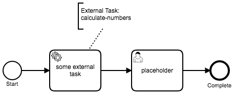
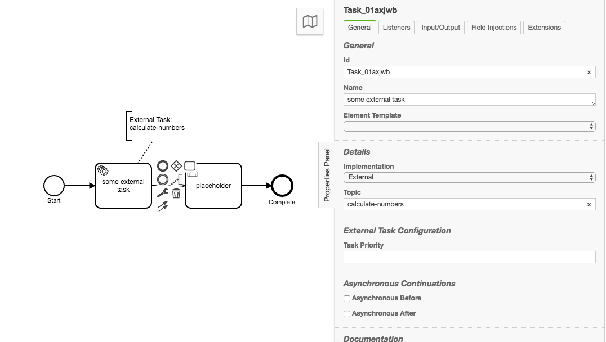
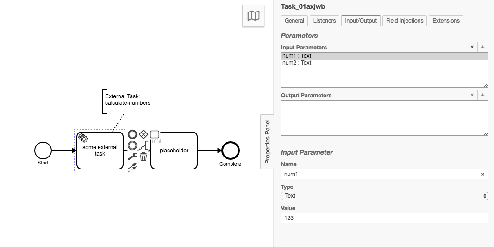
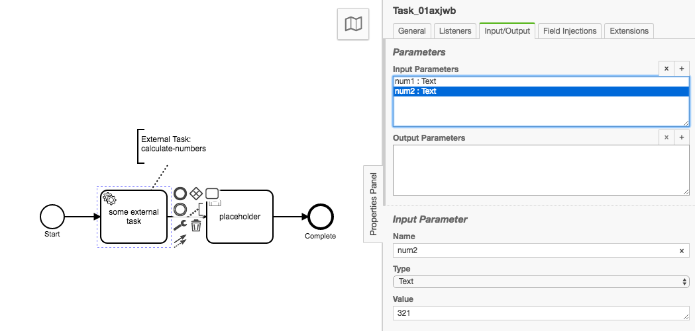
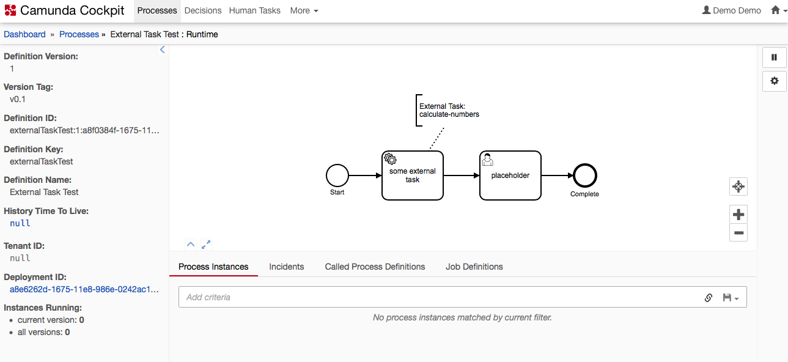
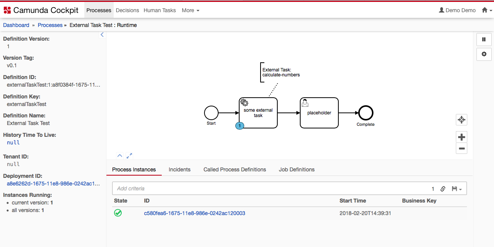
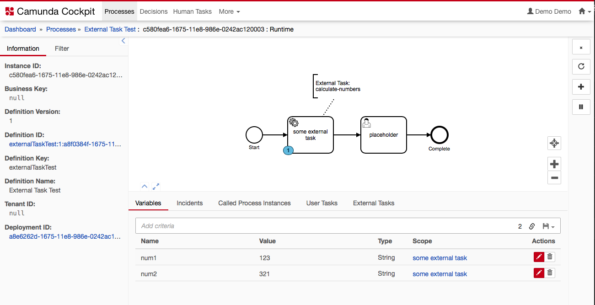
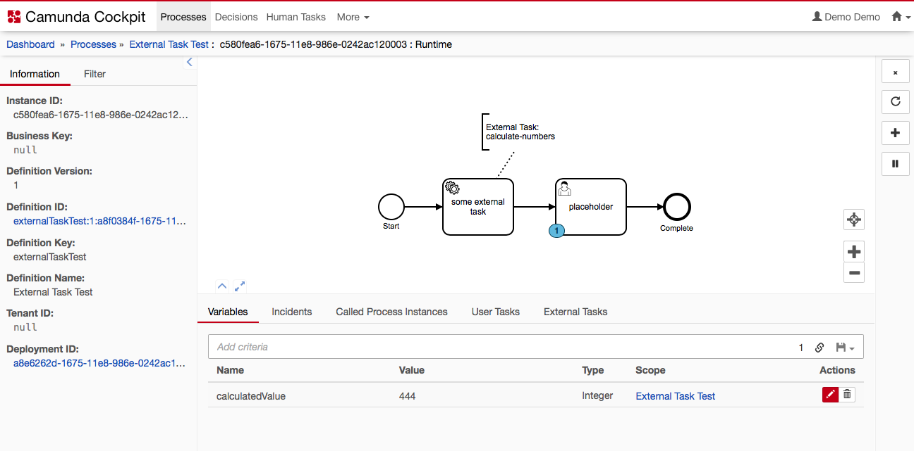

# Camunda Worker (Vertx)

A [CamundaBPM](http://camunda.org) external task worker that offers polyglot event-driven workers with features such as: Auto-Fail-Over, High Availability, Clustering, Multiple Threads and Multi-Core Support, Polyglot language support for: Javascript(with NPM package support), Java, Groovy, Ruby, Scala, Kotlin, and Ceylon.

The worker is based on Vert.x ([vertx.io](http://vertx.io)) and is being bootstrapped with Nashorn/Javascript (other bootstrap languages can be used if you choose).

The benefits of a polyglot worker allows mult-language workers to be created without having to re-program the core interactions of Camunda external tasks.

This worker is a demo worker for showing the potential of Vertx as a External Task worker, and establishes some core use cases and configurations options.

TL;DR: [Take me to how to use it](#how-to-use-it)

# How it works

Overall, docker-compose deploys the `camunda` service (CamundaBPM) and the `cam-worker_01` service (Vertx instance).  Vert.x is deployed in a Docker container running `vertx/vertx3-alpine` which is Linux Alpine with the JVM.  Camunda is deployed in a Docker container. running `camunda/camunda-bpm-platform:tomcat-7.8.0`: A JVM with Tomcat 8 running CamundaBPM 7.8.0.  The two services share the name network through docker-compose.

## Screenshots and Reference examples

### BPMN



See the [camunda-deployment folder](./docs/camunda-deployment/external-task-test.bpmn) for CURL statement and BPMN file of test BPMN file that was used.

### Camunda Modeler Configuration





### Camunda Cockpit








### Console Output

```
cam-worker_01_1  | get-tasks received: go get some external tasks
cam-worker_01_1  | Received response with status code200
cam-worker_01_1  | Array Item count: 1
cam-worker_01_1  | Item: {"activityId":"Task_01axjwb","activityInstanceId":"Task_01axjwb:c58173d9-1675-11e8-986e-0242ac120003","errorMessage":null,"errorDetails":null,"executionId":"c58173d8-1675-11e8-986e-0242ac120003","id":"c581c1ff-1675-11e8-986e-0242ac120003","lockExpirationTime":"2018-02-20T14:50:21.755-0500","processDefinitionId":"externalTaskTest:1:a8f0384f-1675-11e8-986e-0242ac120003","processDefinitionKey":"externalTaskTest","processInstanceId":"c580fea6-1675-11e8-986e-0242ac120003","retries":null,"suspended":false,"workerId":"myWorkerId","topicName":"calculate-numbers","tenantId":null,"variables":{"num1":{"type":"String","value":"123","valueInfo":{}},"num2":{"type":"String","value":"321","valueInfo":{}}},"priority":0}
cam-worker_01_1  | Completed processing array
cam-worker_01_1  | calculate-numbers received: {"activityId":"Task_01axjwb","activityInstanceId":"Task_01axjwb:c58173d9-1675-11e8-986e-0242ac120003","errorMessage":null,"errorDetails":null,"executionId":"c58173d8-1675-11e8-986e-0242ac120003","id":"c581c1ff-1675-11e8-986e-0242ac120003","lockExpirationTime":"2018-02-20T14:50:21.755-0500","processDefinitionId":"externalTaskTest:1:a8f0384f-1675-11e8-986e-0242ac120003","processDefinitionKey":"externalTaskTest","processInstanceId":"c580fea6-1675-11e8-986e-0242ac120003","retries":null,"suspended":false,"workerId":"myWorkerId","topicName":"calculate-numbers","tenantId":null,"variables":{"num1":{"type":"String","value":"123","valueInfo":{}},"num2":{"type":"String","value":"321","valueInfo":{}}},"priority":0}
cam-worker_01_1  | numbers: 123 and 321
cam-worker_01_1  | task-complete received: {"source":{"activityId":"Task_01axjwb","activityInstanceId":"Task_01axjwb:c58173d9-1675-11e8-986e-0242ac120003","errorMessage":null,"errorDetails":null,"executionId":"c58173d8-1675-11e8-986e-0242ac120003","id":"c581c1ff-1675-11e8-986e-0242ac120003","lockExpirationTime":"2018-02-20T14:50:21.755-0500","processDefinitionId":"externalTaskTest:1:a8f0384f-1675-11e8-986e-0242ac120003","processDefinitionKey":"externalTaskTest","processInstanceId":"c580fea6-1675-11e8-986e-0242ac120003","retries":null,"suspended":false,"workerId":"myWorkerId","topicName":"calculate-numbers","tenantId":null,"variables":{"num1":{"type":"String","value":"123","valueInfo":{}},"num2":{"type":"String","value":"321","valueInfo":{}}},"priority":0},"result":444}
cam-worker_01_1  | Received response with status code204
cam-worker_01_1  | Camunda Task Completion Response:null
```


## Vertx Instance

The Vertx instance, named: cam-worker_01 in the docker-compose file, and camunda-worker in Vertx configurations.

The goal of this project was to us Javascript/nashorn language is used for all aspects, including bootstrap of the Vertx instance.  Other languages could be used, but it was to test configuration and use case opportunities against the Node Camunda External task worker: https://github.com/nikku/camunda-worker-node

The great part is that we can easily use other languages with the same Vertx instance such as:

1. Java
1. Groovy
1. Ruby
1. Ceylon
1. Scala
1. Kotlin

See Vertx.io for more information.


### Verticles

#### camunda-worker.js

Establishes the primary verticle that deploys the other verticles.
Also has a example of accessing the config.json file that is deployed.

[Source](./worker/camunda-worker.js)

#### fetch-and-lock.js

Fetches Camunda external tasks from Camunda External Tasks using the defined configuration

[Source](./worker/verticles/fetch-tasks/fetch-and-lock.js)

#### calculate-numbers.js

Catches data from the event bus and runs a calculation (addition of two numbers) and sends it to the task-complete verticle 

[Source](./worker/verticles/process-calculate-numbers/calculate-numbers.js)

#### task-complete.js

Completes the external task with the result provided by the calculate-numbers verticle.

[Source](./worker/verticles/task-complete/task-complete.js)

#### http-server.js

A web server that exposes the `localhost:8081/get-tasks` endpoint, which will trigger the fetch-tasks verticle.

[Source](./worker/verticles/http-server/httpserver.js)

## Camunda Instance

The camunda instance is a basic deployment of the Camunda Docker container: https://github.com/camunda/docker-camunda-bpm-platform, using Tomcat and Camunda BPM 7.8.0.

Camunda Web Apps: `localhost:8055/camunda/`
Camunda REST API: `localhost:8055/engine-rest/`


## How to Use it

1. Open terminal into root of repo: run `docker-compose up --build`
1. It will take a few seconds for camundaBPM and Vertx to startup.  Watch the terminal for progress.
1. deploy the BPMN file to camunda (`localhost:8055/engine-rest`).  [See the CURL statement and BPMN file](./docs/camunda-deployment)
1. Through the Camunda tasklist (`localhost:8055/camunda/app/tasklist`), start an instance of the process "External Task Test".  You should see a running instance afterwards in the Camunda Cockpit.
1. In your browser go to: `localhost:8081/get-tasks`.  This is the Vertx server route that will tell vertx instance to check camunda for tasks.


# Project Notes

This is a growing list of project notes and considerations

1. Exponential Backoff needs to be implemented in the Fetch and Lock verticle.
1. A timer needs to be added to the Fetch and Lock allowing timed capture.  Only new tasks should be gotten if there are not active tasks.
1. Further configuration options for task fetch and task completion need to be added.  This was just a initial demonstration.
1. See the Fetch and Lock verticle for a example of how Arrays are iterated through
1. Vertx returns most objects as JS Objects rather than the typical Nashorn mirror objects
1. See the Vertx dockerfile for the CMD line that executes the `vertx run` command.  This command is what activates the Vertx instance which is accessible in the camunda-worker.js verticle.
1. To enable High Availability (`-ha`) see the Docker-Compose file and the cluster.xml.  You can easily test `-ha` by enabling it in the docker-compose file, and then generating a `vertx run -ha` service in the docker-compose file.
1. the Vertx dockerfile expects several files for deployment.
1. The Vertx Stack Manager is used to download Maven dependencies.  See the verxt-stack.json file.
1. See the fetch-and-lock verticle for example of using NPM modules and using `require()` in the JS files.


